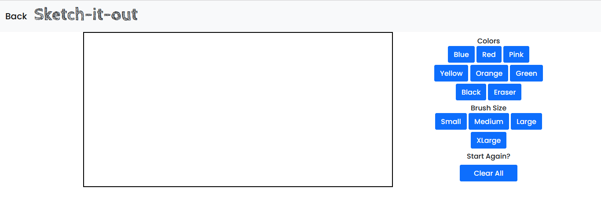
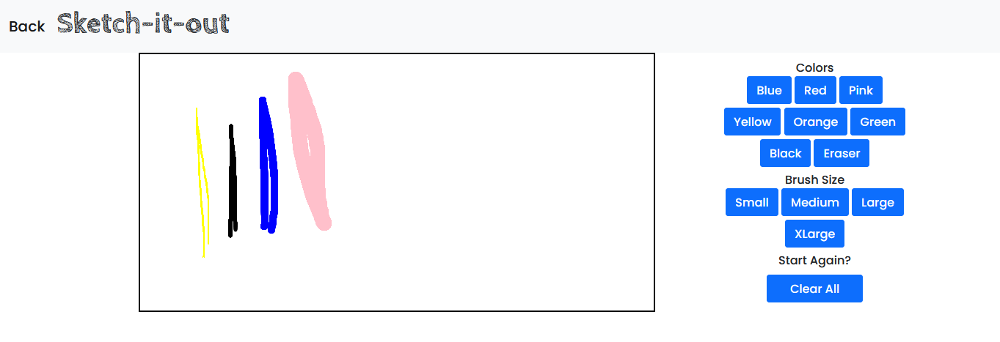

# Sketch-it-out ✏️

View the live website [here.](https://aausen.github.io/sketch-it-out/)

Sketch-it-out is a free-hand drawing web application. Users can choose a brush size 
and color for their brush, then then start sketching. 

There is an option for an eraser as well as an option to clear all and start over again. Happy sketching!

# Tech Stack
- JavaScript
- HTML
- CSS
- Bootstrap

# APIs and Libraries
- Canvas API

# Installation

- Clone the repository onto your own machine using your favorite code editor.
- Get started adding your own features and personal touches.
- Open the index.html file using your favorite browser.

# Deploying the Game
 
 I used GitHub Pages to deploy this site. 
 - Open the respository 
 - Click 'Settings' on the top navigation bar for this respository
 - Find 'Pages' on the left menu and select that
 - Under Source select which branch to use for deployment
 - Click Save and your site is ready to be viewed!

 This application was built for the Mintbean November Hackathon